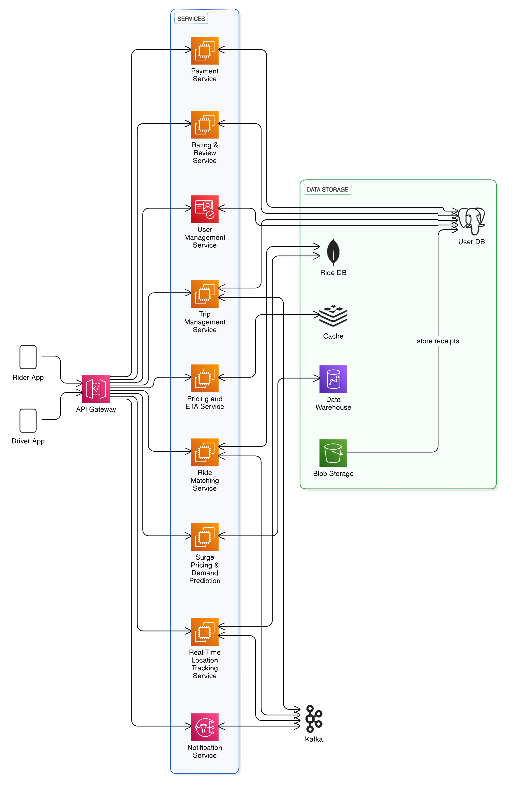

# Ride-Sharing System

This document provides an overview of the ride-sharing system's architecture and functionality, covering client-side applications, backend services, data storage, and potential future enhancements.

---



---

## Table of Contents
1. [Client-Side Applications](#client-side-applications)
2. [Backend Services](#backend-services)
3. [Data Storage and Databases](#data-storage-and-databases)
4. [Service Connections](#service-connections)
5. [Kafka Service](#kafka-service)
6. [Key Use Cases](#key-use-cases)
7. [Ride-Matching Logic](#ride-matching-logic)
8. [Future Enhancements](#future-enhancements)

---

## Client-Side Applications

- **Rider App**: Users request rides, view drivers, track rides, make payments, and rate drivers.  
- **Driver App**: Drivers receive ride requests, manage trip status, and accept payments.

---

## Backend Services

- **API Gateway**: Routes client requests to backend services.

### Core Services:
- **Ride Matching Service**: Matches riders with nearby drivers based on availability.  
- **Location Tracking Service**: Tracks real-time rider and driver locations.  
- **Pricing and ETA Service**: Calculates fares and estimated arrival times.  
- **Notification Service**: Sends notifications for trip status changes.  
- **Payment Service**: Manages transactions and driver payouts.  
- **Trip Management Service**: Handles the trip lifecycle.  
- **User Management Service**: Authenticates users and manages profiles.  
- **Surge Pricing & Demand Prediction**: Adjusts fares based on demand analytics.

---

## Data Storage and Databases

- **User Database**: Stores user profiles and payment data.  
- **Ride Database**: Stores trip history and details.  
- **Cache (Redis)**: Caches frequently accessed data.  
- **Data Warehouse**: Stores historical data for analytics.  
- **Blob Storage**: Stores receipts and documents.

---

## Service Connections

- Rider App → API Gateway → Ride Matching Service  
- Driver App → API Gateway → Trip Management Service  
- Notification Service ↔ Rider & Driver Apps  
- Payment Service ↔ User Database  

---

## Kafka Service

- **Event Streaming**: Streams real-time events between services.  
- **Decoupling**: Enables asynchronous service communication.  
- **Event Persistence**: Stores events for recovery and analytics.

---

## Key Use Cases

- **Ride Request Processing**: Rider app sends ride requests to the backend.  
- **Location Updates**: Location data is streamed to track trips.  
- **Trip Status Notifications**: Notification service updates users on ride status.  

---

## Ride-Matching Logic

This program matches a rider with the nearest available driver and calculates the fare.

### Matching Process:

1. **Driver Input**: Collects multiple driver names and locations.  
2. **Rider Input**: Collects rider name and location.  
3. **Matching Logic**: Identifies the closest driver using Cartesian distance.  
4. **Fare Calculation**: Uses the formula `Fare = $5 × Distance`.


## Distance Calculation

The system calculates the distance between two geographical points using the following formula:

The system calculates the distance between two points using:  

```
Distance = sqrt((latitude difference)^2 + (longitude difference)^2)

```

This formula is a simplified version of the Haversine formula, used here for demonstration purposes to calculate the straight-line distance between two points on a plane.


### Example Input:

```text

INPUT::
Enter the number of drivers: 2
Enter name for Driver 1: John
Enter latitude for Driver 1: 10.0
Enter longitude for Driver 1: 10.0
Enter name for Driver 2: Alice
Enter latitude for Driver 2: 20.0
Enter longitude for Driver 2: 20.0

Enter rider's name: Bob
Enter rider's latitude: 10.5
Enter rider's longitude: 10.5

OUTPUT::
Matched Bob with John
Fare: $3.53553

```

---

## Future Enhancements

1. **Haversine Formula**: 
   - Implement the Haversine formula to calculate real-world distances on a sphere, providing more accurate distance measurements.

2. **Multiple Riders**:
   - Extend the service to handle multiple riders concurrently, allowing for batch processing of ride requests.

3. **Driver Reassignment**:
   - Allow drivers to rejoin the pool of available drivers after completing a trip, enabling continuous ride matching.

4. **Surge Pricing**:
   - Implement dynamic pricing based on demand, adjusting fares during peak times to balance supply and demand.
